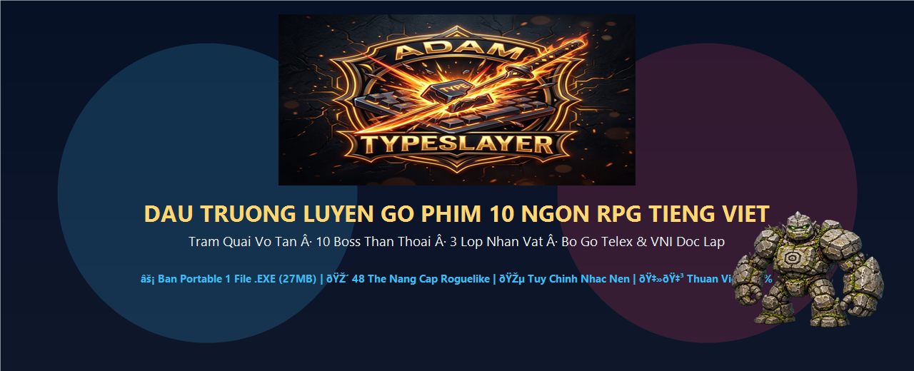
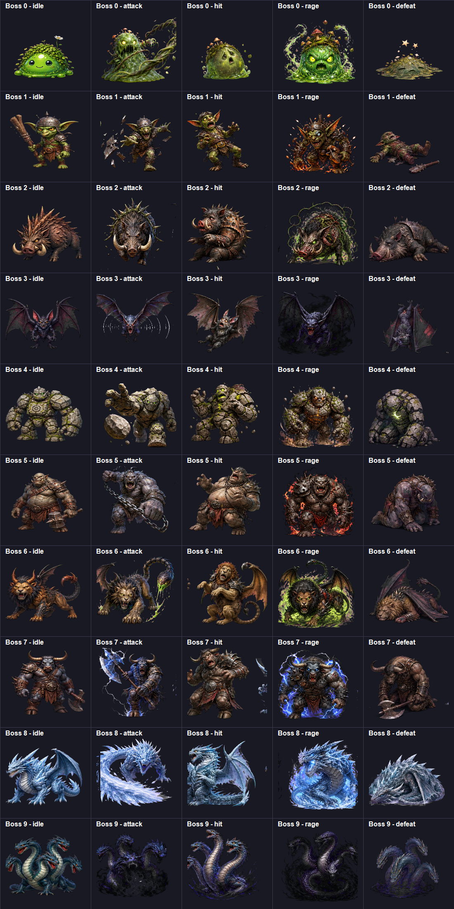

<div align="center">

# ⚔️ ADAM TYPE SLAYER ⚔️
### Đấu Trường Luyện Gõ Phím 10 Ngón RPG Diệt Boss Tiếng Việt
**Trảm quái vô tận · 10 Boss Thần Thoại · 3 Lớp Nhân Vật · Bộ Gõ Telex & VNI Độc Lập**

[](https://github.com/)
[-critical?style=for-the-badge&logo=creative-commons)](LICENSE)
[](https://github.com/)
[-emerald?style=for-the-badge&logo=speedtest)](https://github.com/)
[](https://github.com/)

---



</div>

---

## 🌟 GIỚI THIỆU TỔNG QUAN

**Adam Type Slayer** là một tựa game nhập vai chiến thuật kết hợp luyện gõ phím 10 ngón tiếng Việt thời gian thực (Typing Action RPG). Người chơi sẽ hóa thân thành các hiệp sĩ huyền thoại, sử dụng tốc độ gõ phím chuẩn xác cùng tư duy chọn thẻ nâng cấp Roguelike để tung chiêu thức, né đòn và hạ gục 10 chúa tể Boss hắc ám vô cùng hung bạo.

Game hỗ trợ song song cả **phiên bản Web chạy trực tiếp trên trình duyệt** và **phiên bản Ứng dụng Desktop Portable 1 File `.exe` duy nhất (~27MB)** khởi động tức thì, không cần cài đặt.

---

## 🎮 TÍNH NĂNG NỔI BẬT

### 1. ⌨️ Hệ Thống Bộ Gõ Tiếng Việt Độc Lập
* Hỗ trợ đầy đủ 2 chuẩn gõ phổ biến nhất: **TELEX** và **VNI**.
* **Khóa bộ gõ ngoài tự động**: Tích hợp thuật toán chuyển phím vật lý trực tiếp từ bàn phím (`KeyboardEvent.code`), loại bỏ hoàn toàn hiện tượng dính chữ, gõ lặp hay xung đột với phần mềm bên ngoài (UniKey, EVKey, OpenKey). UniKey bật hay tắt đều chơi mượt mà $100\%$.
* **Bàn phím ảo & Hướng dẫn ngón tay trực quan**: Mô phỏng vị trí ngón tay chuẩn xác từng phím (ASDF - JKL;), giúp người chơi vừa giải trí vừa nâng cao phản xạ gõ 10 ngón không cần nhìn bàn phím.

### 2. 🛡️ 3 Lớp Nhân Vật Độc Đáo
Mỗi hiệp sĩ sở hữu hệ thống chỉ số, 3 tuyệt kỹ riêng biệt và phong cách xuất chiêu đặc sắc:
* 🗡️ **Sát Thủ (Assassin)**: Tốc độ tấn công cực nhanh, tỷ lệ Bạo Kích cao, né tránh đòn đánh nguy hiểm và phủ độc giảm công lực Boss.
* 🛡️ **Chiến Binh (Warrior)**: Lượng máu dồi dào (+50% HP), giương khiên phản đòn chặn sát thương và thi triển Trọng Trảm chẻ đôi mặt đất.
* 🧙‍♂️ **Pháp Sư (Mage)**: Sức mạnh phép thuật tối thượng với Hỏa Cầu bùng cháy, Băng Phong đông cứng ngắt chiêu và Lôi Liên sấm sét giáng từ trời cao.

### 3. 👹 10 Boss Thần Thoại & Trí Tuệ Nhân Tạo Chiến Đấu (AI Boss)
Mỗi Boss sở hữu tạo hình pixel chi tiết, cơ chế ra chiêu biến ảo và trạng thái **Cuồng Nộ (RAGE Mode)** khi máu xuống thấp:

<div align="center">



</div>

1. 🟢 **Vua Slime Rêu Rậm** *(Vòng 1 - Đảo Mây)*: Nhảy đè chấn động, hồi phục sinh lực khi tấn công.
2. 👹 **Yêu Tinh Răng Sắt** *(Vòng 2 - Rừng Thiêng)*: Chém chùy cuồng nộ và ném đá độc.
3. 🐗 **Lợn Rừng Lưng Gai** *(Vòng 3 - Vực Hư Không)*: Húc ủi liên hoàn, giáp gai phản sát thương.
4. 🗿 **Người Đá Cổ Đại** *(Vòng 4 - Hang Pha Lê)*: Ném tảng thiên thạch khổng lồ, triệu hồi tường đá hộ thân.
5. ⛓️ **Độc Nhãn Khổng Lồ** *(Vòng 5 - Hỏa Diệm Sơn)*: Đập búa sắt gây choáng, kích hoạt cuồng nộ càn quét.
6. 🦁 **Sư Tử Gai Manticore** *(Vòng 6 - Đấu Trường Sấm)*: Bắn gai độc đuôi bọ cạp, cào xé xé toạc giáp.
7. 🐂 **Ngưu Ma Vương Minotaur** *(Vòng 7 - Hoang Mạc)*: Bổ rìu sét sấm chớp, gầm thét tăng công kích.
8. 🐉 **Băng Long Bắc Cực** *(Vòng 8 - Băng Đảo)*: Thổi bão tuyết đóng băng thời gian gõ phím.
9. 🐍 **Rắn Thần Hư Không Hydra** *(Vòng 9 - Thủy Cung)*: Phun nọc độc tử thần liên hoàn 3 đầu.
10. 👑 **Chúa Tể Hắc Ám Dark Lord** *(Vòng 10 - Thánh Điện Hắc Ám)*: Hút sinh lực, triệu hồi thiên thạch hủy diệt thế giới.

---

### 4. 🎴 Kho Nâng Cấp Roguelike 48 Thẻ Bài
Sau mỗi chiến thắng vẻ vang, người chơi được lựa chọn 1 trong 3 thẻ bài nâng cấp sức mạnh ngẫu nhiên:
* ⚪ **Thường (30 Thẻ)**: Tăng tốc độ đánh, tăng sát thương cơ bản, hồi máu sau mỗi từ gõ đúng.
* 🔷 **Hiếm (7 Thẻ)**: Gia tăng tỷ lệ bạo kích, giảm thời gian hồi chiêu, kích hoạt khiên chắn.
* 🟣 **Sử Thi (6 Thẻ)**: Kháng đòn tử vong, sát thương bùng nổ diện rộng, hồi chiêu tức thì.
* 👑 **Huyền Thoại (5 Thẻ)**: Sức mạnh tối thượng biến đổi hoàn toàn cục diện trận chiến.

---

### 5. 🎵 Tùy Chỉnh Nhạc Nền Tự Do (Custom BGM)
* Tích hợp sẵn 6 bản nhạc giao hưởng RPG hùng tráng.
* Hỗ trợ **chọn cả thư mục nhạc** hoặc **chọn nhiều file nhạc** (`.mp3`, `.ogg`, `.wav`, `.m4a`) từ máy tính để phát nhạc nền theo sở thích cá nhân.
* Hỗ trợ kéo & thả trực tiếp file nhạc vào cửa sổ game bất kỳ lúc nào.

---

## 🚀 HƯỚNG DẪN CÀI ĐẶT & CHƠI GAME

### Cách 1: Chơi Nhanh Bằng File `.EXE` (Khuyên dùng trên Windows)
1. Tải về file **`TypeSlayer_Portable.exe`** (chỉ **27.2 MB**).
2. Nhấp đúp chuột vào file để mở và trải nghiệm game ngay lập tức trong cửa sổ riêng biệt $60\text{ FPS}$ (Không cần cài đặt bất kỳ phần mềm nào).
3. Nhấn phím **F11** để bật/tắt chế độ Toàn Màn Hình.

### Cách 2: Chơi Trực Tiếp Trên Trình Duyệt Web
1. Mở file **`index.html`** bằng bất kỳ trình duyệt hiện đại nào (Google Chrome, Microsoft Edge, Brave, Cốc Cốc, Firefox).
2. Chọn Kiểu gõ (Telex / VNI), nhập tên nhân vật, chọn Hiệp Sĩ yêu thích và bấm **⚔ VÀO GAME**.

---

## 🛠️ PHÍM TẮT & ĐIỀU KHIỂN

| Phím tắt | Chức năng |
| :--- | :--- |
| **Bàn phím cơ / Laptop** | Gõ trực tiếp chữ cái theo từ mẫu tiếng Việt hiển thị trên màn hình |
| **Q / W / E** | Kích hoạt Tuyệt Kỹ 1 / 2 / 3 của nhân vật khi đủ điểm Nộ |
| **Esc / P** | Tạm dừng trận đấu (Pause Game) |
| **F11** | Bật / Tắt chế độ Toàn màn hình (Fullscreen) |
| **F9** | Mở bảng kiểm thử Developer QA Mode (Ẩn ngầm) |

---

## 📁 CẤU TRÚC THƯ MỤC DỰ ÁN

```text
type_slayer_final_v9_14/
│
├── TypeSlayer_Portable.exe      # File chạy game độc lập duy nhất (27MB)
├── TypeSlayer.exe               # Trình khởi chạy siêu nhẹ (50KB)
├── index.html                   # Giao diện chính của game (HTML5 Semantic)
├── style.css                    # Toàn bộ hiệu ứng CSS3, Animation & Layout
├── game.js                      # Bộ điều khiển logic RPG, Audio Engine & IME
├── app.ico                      # Icon ứng dụng chất lượng cao
├── README.md                    # Tài liệu giới thiệu dự án
│
└── assets/                      # Toàn bộ tài nguyên game (WebP / OGG / PNG)
    ├── bg/                      # Hình nền cảnh quan đấu trường sắc nét
    ├── sprites/                 # Hình ảnh nhân vật 3 Hero & 50 tư thế Boss
    ├── audio/                   # Nhạc nền giao hưởng RPG & Giọng lồng tiếng
    └── sfx/                     # Hiệu ứng âm thanh chặt chém, trúng đòn, phép thuật
```

---

## 📜 BẢN QUYỀN & GIẤY PHÉP (LICENSE)

* **Tác giả**: Phát triển và thiết kế bởi **ADAM ECOSYSTEM**.
* **Giấy phép**: Được phân phối theo giấy phép quốc tế **[Creative Commons Attribution-NonCommercial-ShareAlike 4.0 International (CC BY-NC-SA 4.0)](LICENSE)**.
* 🚫 **NGHIÊM CẤM THƯƠNG MẠI HÓA (NON-COMMERCIAL)**:
  * Tuyệt đối **không được phép bán lại**, đóng gói thương mại, thu phí người chơi hoặc chèn quảng cáo kiếm tiền dưới mọi hình thức.
  * Chỉ được phép tải về, chia sẻ, sử dụng và phát triển cho **mục đích cá nhân, học tập, nghiên cứu và rèn luyện kỹ năng gõ phím phi lợi nhuận**.

<div align="center">

⭐ **Nếu bạn yêu thích tựa game này, hãy nhấn `Star` trên GitHub để ủng hộ dự án nhé!** ⭐

</div>
